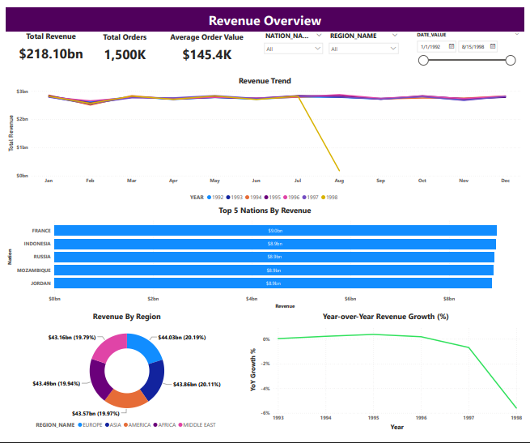
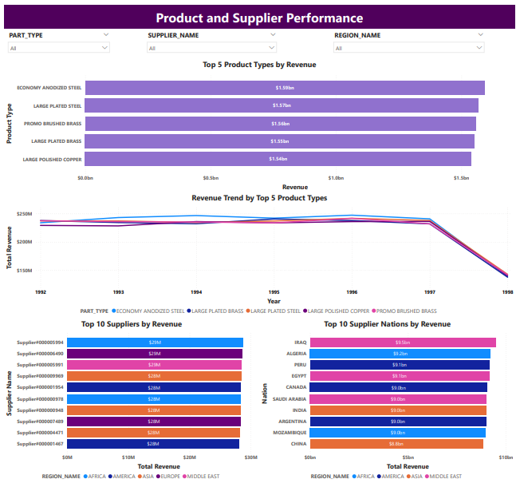

# Wholesale Parts Distributor — Revenue & Supplier Performance Dashboard

A Power BI dashboard built on the Snowflake `SNOWFLAKE_SAMPLE_DATA.TPCH_SF1` dataset, analyzing revenue trends, regional performance, and product/supplier insights for a wholesale parts distribution business.

## Preview

## What's in this repo
- `report.pbix` — link below 
-  [`tpch_views.sql`](tpch_views.sql) — all SQL views used to build the data model in Snowflake
-  [`documentation.md`](documentation.md) — full write-up: data model design, SQL, DAX measures, and page-by-page breakdown of the report

## Report
📊 [Download the .pbix file](https://drive.google.com/file/d/16Q2sKh5hY_TrKK0w0HLcvpBBQGTWAOvh/view?usp=drive_link) 

## Quick summary
- Built a clean star schema in Snowflake (1 fact table, 4 dimension tables) rather than importing all 8 raw tables and relying on auto-detected relationships
- DAX measures go beyond simple sums: year-over-year comparisons, percent-of-total, and ranking
- Two report pages: Revenue Overview, and Product & Supplier Performance

See [`documentation.md`](documentation.md) for full details on design decisions, SQL, and DAX.
